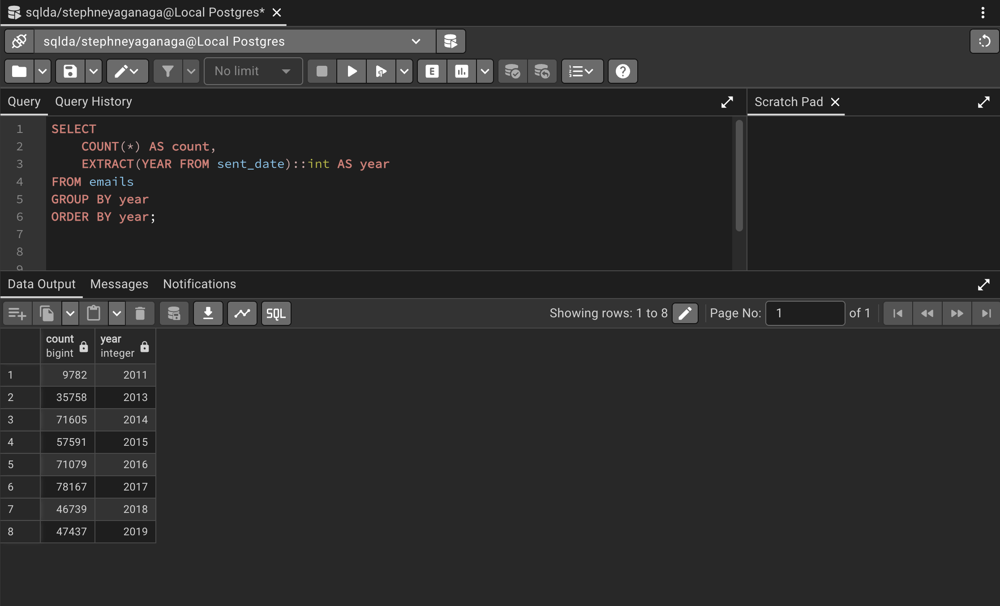
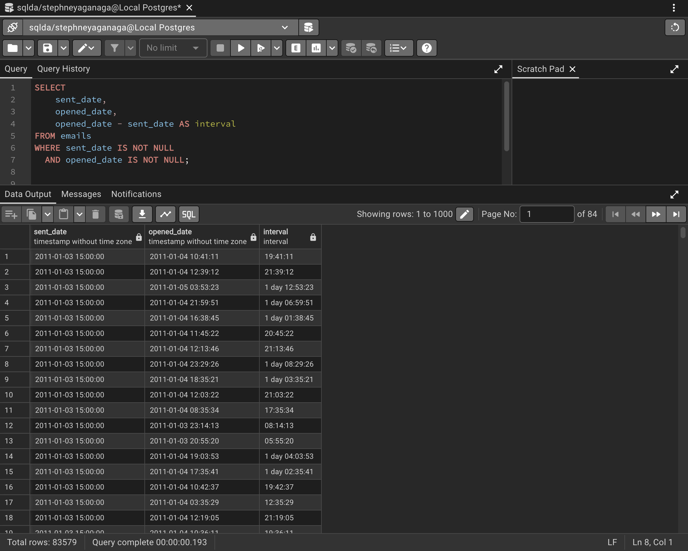
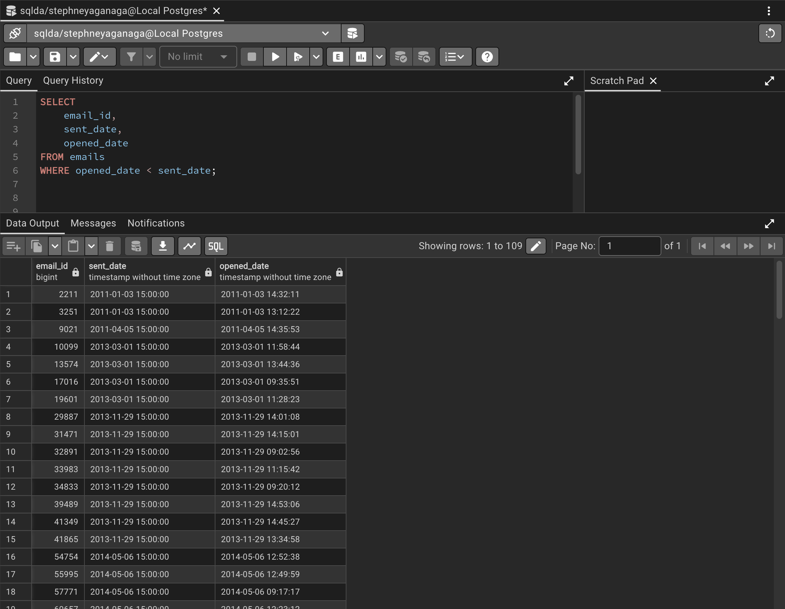
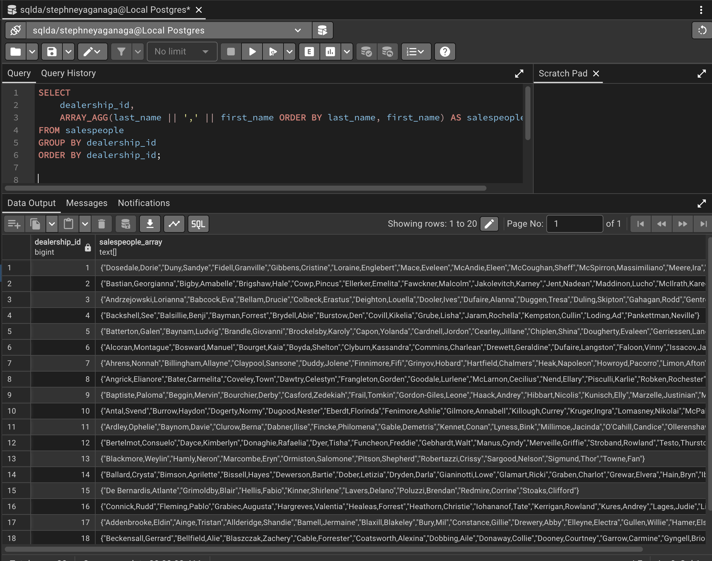
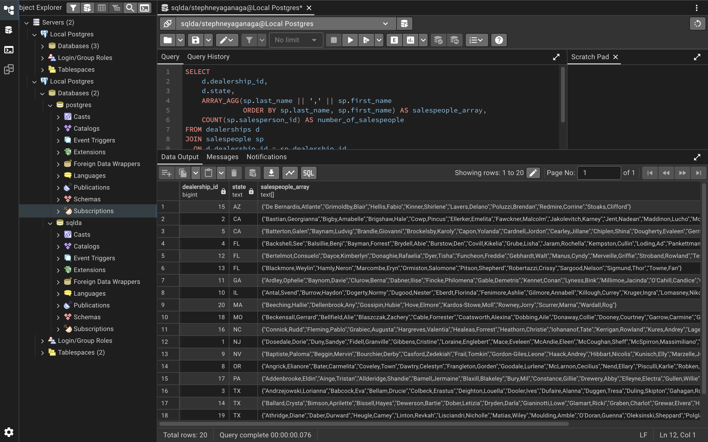
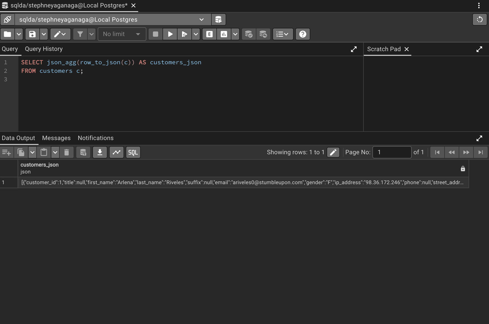
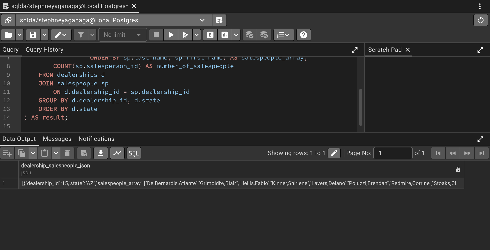

# Exercise 05: SQLDA Database - Dates, Data Quality, Arrays, and JSON

- Name:Blessing Aganaga
- Course: Database for Analytics
- Module:05
- Database Used:  `sqlda` (Sample Datasets)
- Tools Used: PostgreSQL (pgAdmin or psql)

---

## Instructions

- Use the **sqlda** database from the "Loading the Sample Datasets" instructions.
- For each SQL task:
  - Include your SQL in a fenced code block
  - Execute it and include a **screenshot** showing the query and results
- Store screenshots in the `screenshots/` folder and embed them below each answer.
- For explanation questions:
  - Write your answer in complete sentences
  - Include a screenshot if requested

---

## Question 1

Using the `sqlda` database, write the SQL needed to show a **list of years** that emails were sent.

Your results should list years like this (order matters):

```
year
2011
2013
2014
2015
2016
2017
2018
2019
```

### SQL

```sql
-- SELECT DISTINCT
    EXTRACT(YEAR FROM sent_date)::int AS year
FROM emails
ORDER BY year;

```

### Screenshot


---

## Question 2

Using the `sqlda` database, write the SQL needed to show the **number of messages sent by year**, ordered by year (as shown in the prompt).

Output should resemble:

```
count   year
...
```

### SQL

```sql
-- SELECT
    COUNT(*) AS count,
    EXTRACT(YEAR FROM sent_date)::int AS year
FROM emails
GROUP BY year
ORDER BY year;

```

### Screenshot



---

## Question 3

Using the `sqlda` database, write the SQL needed to show:
- the **sent date**
- the **opened date**
- the **interval** between the two

Only include emails that contain **both** a sent date and an opened date.

### SQL

```sql
-- SELECT
    sent_date,
    opened_date,
    opened_date - sent_date AS interval
FROM emails
WHERE sent_date IS NOT NULL
  AND opened_date IS NOT NULL;

```

### Screenshot



---

## Question 4

Using the `sqlda` database, write the SQL needed to show emails that contain an **opened date BEFORE the sent date**.

### SQL

```sql
-- SELECT
    email_id,
    sent_date,
    opened_date
FROM emails
WHERE opened_date < sent_date;

```

### Screenshot



---

## Question 5

Using the `sqlda` database: there are **over 100 emails** that contain an opened date **BEFORE** the sent date.

After looking at the data, **why is this the case?**

### Answer

_This occurs because the sent date values are often set to a fixed time (such as 15:00:00), while the opened date records the actual time the email was opened. Since the timestamps may use different time conventions or standardized send times, the opened date can appear earlier than the sent_date even though the email was not actually opened before it was sent.

### Screenshot (if requested by instructor)


---

## Question 6

Using the `sqlda` database, explain in your own words what the following code does:

```sql
CREATE TEMP TABLE customer_points AS (
    SELECT
        customer_id,
        point(longitude, latitude) AS lng_lat_point
    FROM customers
    WHERE longitude IS NOT NULL
    AND latitude IS NOT NULL
);

CREATE TEMP TABLE dealership_points AS (
    SELECT
        dealership_id,
        point(longitude, latitude) AS lng_lat_point
    FROM dealerships
);

CREATE TEMP TABLE customer_dealership_distance AS (
    SELECT
       customer_id,
       dealership_id,
       c.lng_lat_point <@> d.lng_lat_point AS distance
    FROM customer_points c
    CROSS JOIN dealership_points d
);
```

### Answer

_This code creates three temporary tables to calculate the distance between customers and dealerships using geographic coordinates. The first temporary table, customer_points, selects customers who have valid longitude and latitude values and converts those coordinates into a Postgres point data type. The second temporary table, dealership_points, does the same conversion for dealership locations. The third temporary table, customer_dealership_distance, uses a CROSS JOIN to pair every customer with every dealership and then calculates the distance between their point coordinates using the <@> distance operator. Overall, the code prepares location data as points and computes the distance from each customer to every dealership for spatial analysis.

---

## Question 7

Using the `sqlda` database, write SQL to display an **array of salespeople for each dealership**, sorted by dealership.

For example - dealership 1 is below:

```text
"{""Fidell,Granville"",""Onele,Jereme"",""Sheriff,Lelia"",""McSpirron,Massimiliano"",""Rennick,Nadia"",""Mace,Eveleen"",""Oxteby,Dukie"",""Spong,Marcos"",""Wogden,Quent"",""Duny,Sandye"",""Loraine,Englebert"",""Meere,Ira"",""Gibbens,Cristine"",""Prine,Lyda"",""McCoughan,Sheff"",""Schule,Giselbert"",""McAndie,Eleen"",""Dosedale,Dorie"",""Nafziger,Shay""}"
```

### SQL

```sql
-- SELECT
    dealership_id,
    ARRAY_AGG(last_name || ',' || first_name ORDER BY last_name, first_name) AS salespeople_array
FROM salespeople
GROUP BY dealership_id
ORDER BY dealership_id;
```

### Screenshot



---

## Question 8

Using the `sqlda` database, write SQL to display:
- an **array of salespeople for each dealership**
- the **state** of the dealership
- the **number of salespeople** for the dealership

Sort by **state**.

Reference image:


### SQL

```sql
-- SELECT
    d.dealership_id,
    d.state,
    ARRAY_AGG(sp.last_name || ',' || sp.first_name
              ORDER BY sp.last_name, sp.first_name) AS salespeople_array,
    COUNT(sp.salesperson_id) AS number_of_salespeople
FROM dealerships d
JOIN salespeople sp
  ON d.dealership_id = sp.dealership_id
GROUP BY d.dealership_id, d.state
ORDER BY d.state, d.dealership_id;


```

### Screenshot



---

## Question 9

Using the `sqlda` database, write the SQL needed to convert the **customers** table to **JSON**.

### SQL

```sql
-- SELECT json_agg(row_to_json(c)) AS customers_json
FROM customers c;

```

### Screenshot



---

## Question 10

Using the `sqlda` database, write SQL to display:
- an **array of salespeople for each dealership**
- the **state**
- the **number of salespeople**
- sorted by **state**

Then **convert this result to JSON**.

Reference image:


### SQL

```sql
-- SELECT json_agg(result) AS dealership_salespeople_json
FROM (
    SELECT
        d.dealership_id,
        d.state,
        ARRAY_AGG(sp.last_name || ',' || sp.first_name
                  ORDER BY sp.last_name, sp.first_name) AS salespeople_array,
        COUNT(sp.salesperson_id) AS number_of_salespeople
    FROM dealerships d
    JOIN salespeople sp
        ON d.dealership_id = sp.dealership_id
    GROUP BY d.dealership_id, d.state
    ORDER BY d.state
) AS result;

```

### Screenshot


